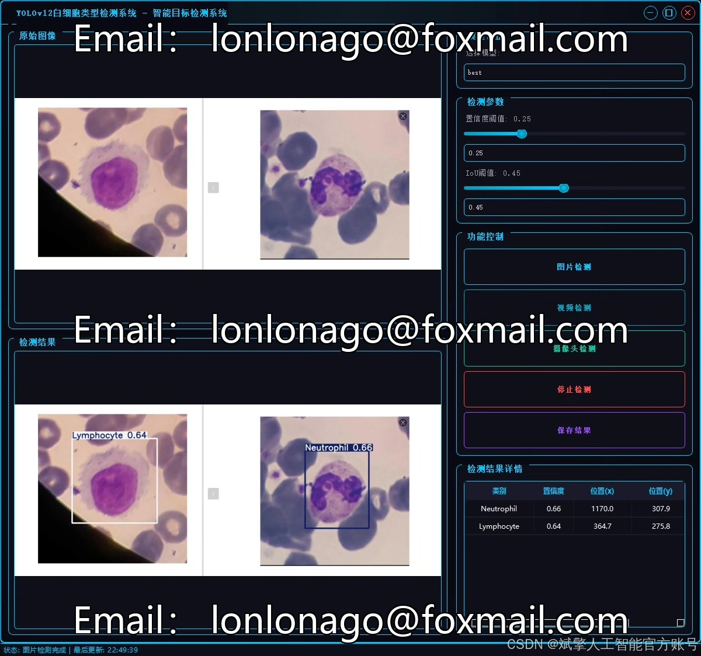
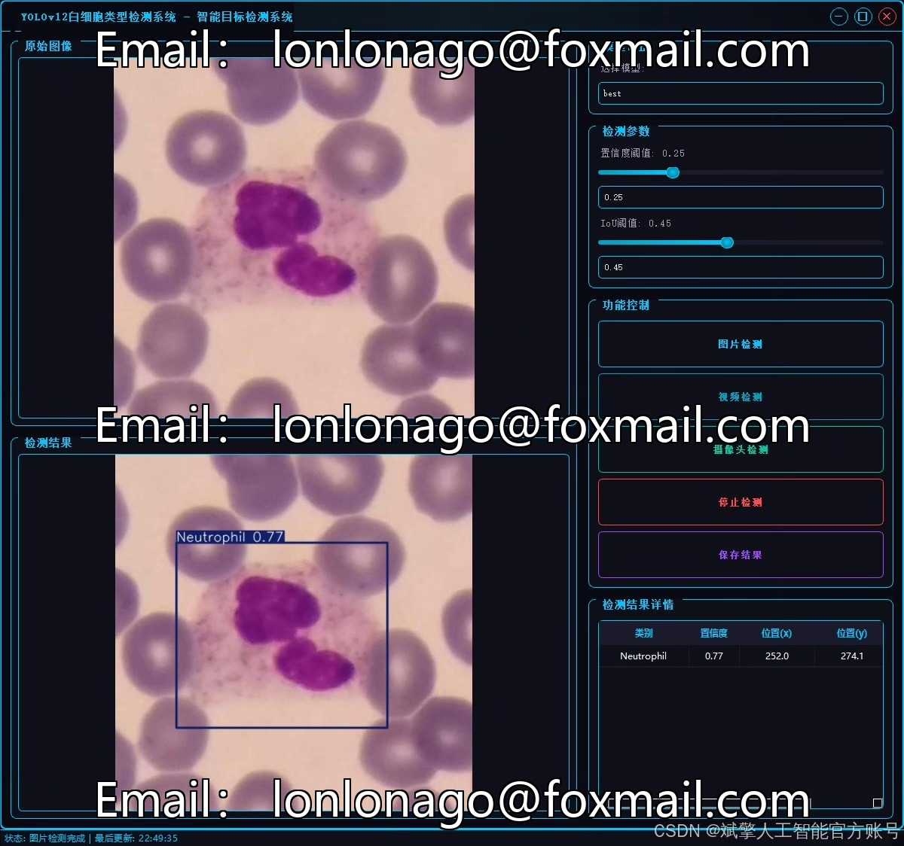
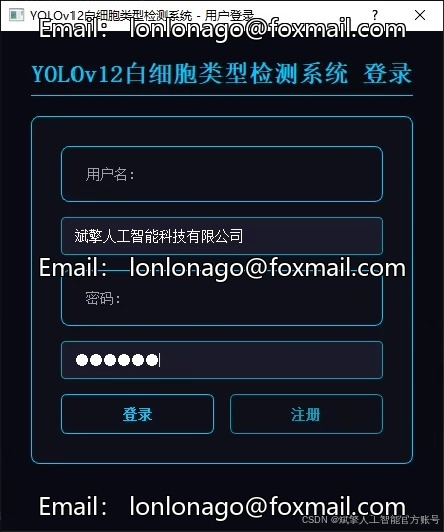
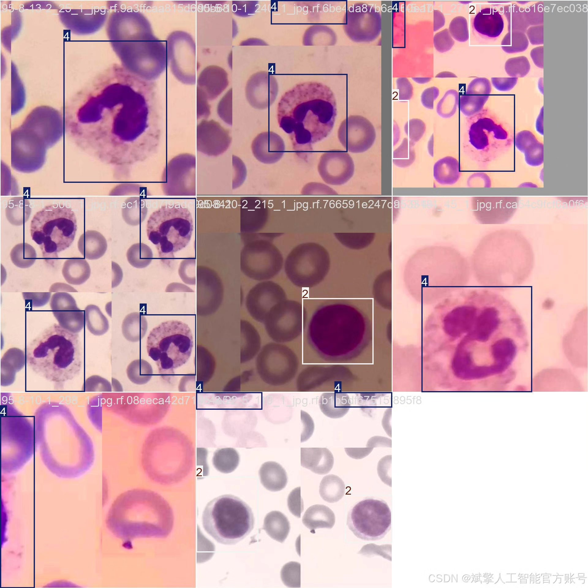
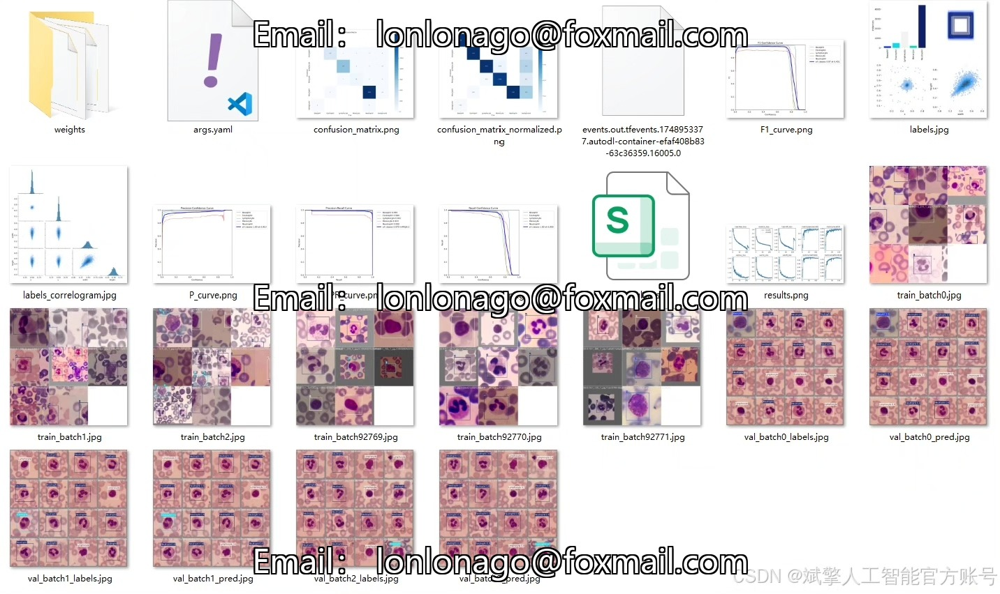
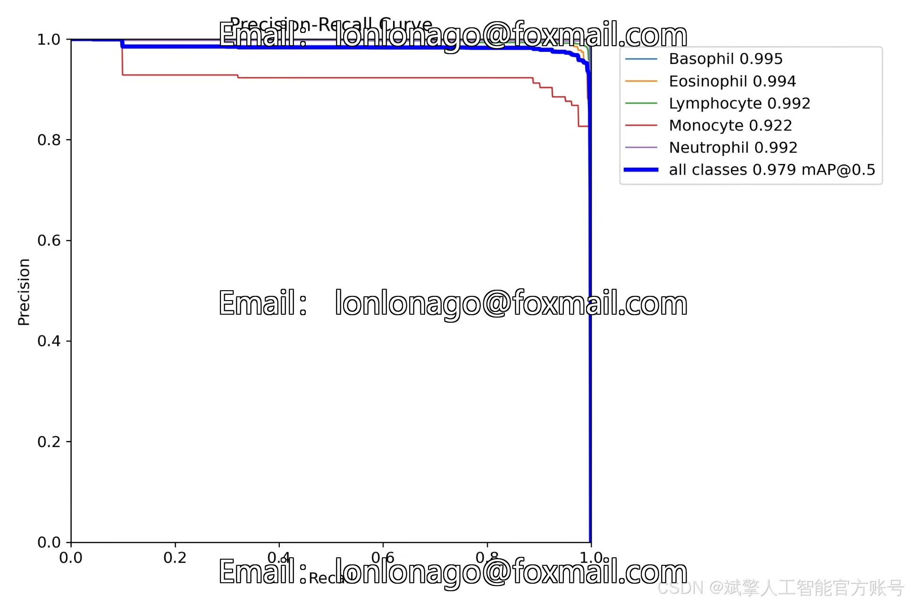
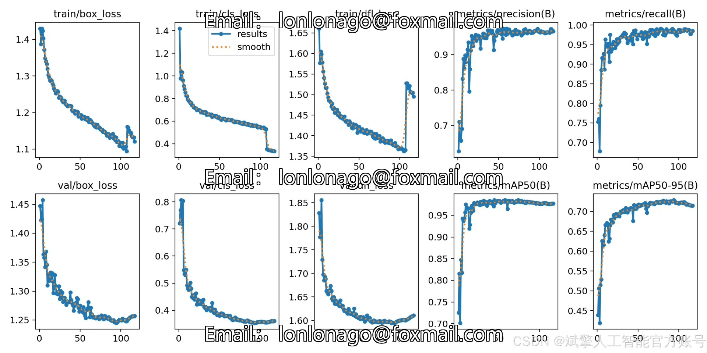
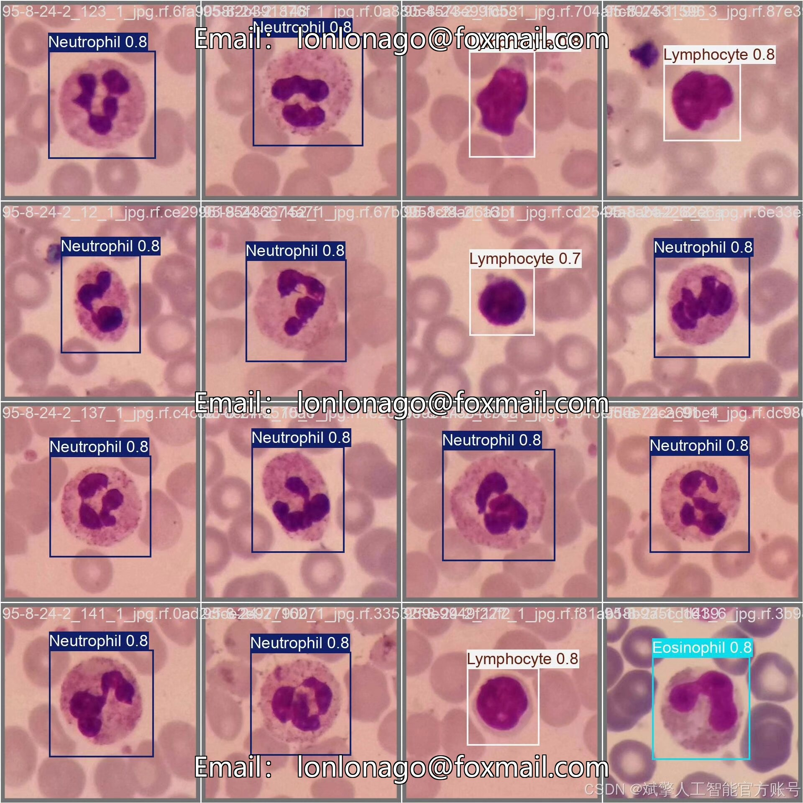

# YOLOv12 Leukocyte Identification System

## Body

YOLOv12 White Blood Cell Identification System Based on Deep Learning YOLOv12: A System for the Detection and Classification of White Blood Cells (YOLOv12+YOLO dataset + UI interface + login registration interface + Python project source code + model)

This paper proposes a system based on deep learning YOLOv12 for the identification and classification of white blood cells, aiming to achieve efficient and accurate hematological cell classification. The system is designed to detect five types of white blood cells (basophils, eosinophils, lymphocytes, monocytes, and neutrophils), using a labeled dataset consisting of 6930 training images and 2970 validation images. By integrating the high-precision object detection capabilities of the YOLOv12 algorithm, the system further integrates a user-friendly UI interface and login registration functions. Experiments show that this system performs exceptionally well in the task of white blood cell classification, providing a reliable automated tool for medical assisted diagnosis. This paper details the design, model optimization, and implementation process of the system, and provides complete Python project source code and pre-trained models, offering a reusable solution for related research.

✅ User Login Registration: Supports password verification and security validation.
✅ Three detection modes: Based on the YOLOv12 model, supports image, video, and real-time camera detection, accurately identifying targets.
✅ Dual-screen comparison: Displays the original image and detection results on the same screen.
✅ Data visualization: Real-time table displaying the category, confidence, and coordinates of detected targets.
✅ Intelligent parameter adjustment: Offers a confidence slide bar to dynamically optimize detection accuracy, adapting to different scene requirements.
✅ Sci-fi style interactive interface: Dark theme combined with dynamic light effects, reducing visual fatigue and improving operational experience.

## Images

## Payment

Here is a pay link on Stripe ( https://buy.stripe.com/3cs8yP7sY87d0vu9AB ). Please contact me lonlonago@foxmail.com after funding $89, and I will send you a complete data files , thank you!

